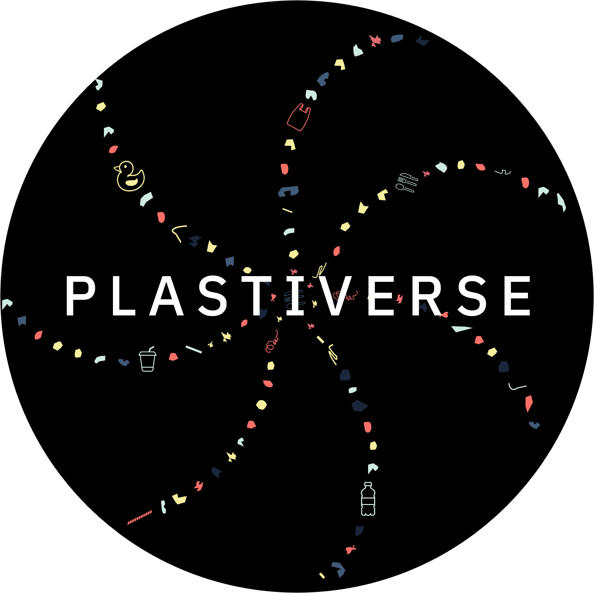
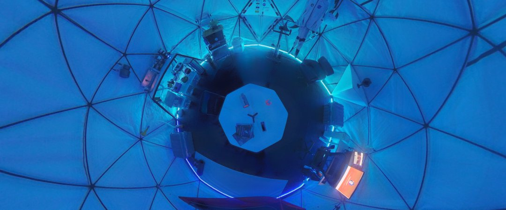
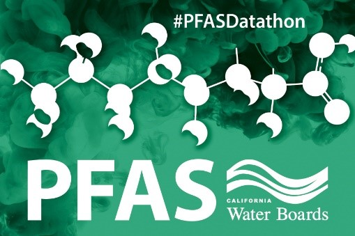

<iframe width="560" height="315"
src="https://www.youtube.com/embed/MUQfKFzIOeU" 
frameborder="0" 
allow="accelerometer; autoplay; encrypted-media; gyroscope; picture-in-picture" 
allowfullscreen></iframe>

## Plastiverse
{:height="200px" width="200px"}

Along with some close friends, I created the Plastiverse - which is a live, crowd-sourced repository for tools, databases, protocols, and information related to micro- and macro-plastics research as well as a web-based forum to exchange knowledge between practitioners related to best-practices, events, jobs and funding opportunities, and guidance for conducting research. This site is a rapidly developing work-in-progress.
* [Follow Plastiverse on Twitter](https://twitter.com/ThePlastiverse)
* [Project Website](https://www.plastiverse.org/)

## ToMEx
{:height="200px" width="200px"}

I developed an RShiny application that allows users to manipulate and visualize toxicity data for microplastics on humans and ecosystems. The app contains data from over 200 peer-reviewed studies. The [Toxicity of Microplastics Explorer (ToMEx) app](https://microplastics.sccwrp.org/) is an *open-source* and *open-data* web-based application that is scheduled to launch in Summer, 2021. While the tool was originally designed for regulatory purposes, it’s accessibility and interactive nature allows use by diverse audiences, including researchers, educators, policy makers, and advocacy groups.

* [Follow ToMExApp on Twitter](https://twitter.com/ToMExApp)
* [Source code](https://github.com/SCCWRP/aq_mp_tox_shiny)

## NASA Space Apps Challenge Winner
{:height="200px" width="400px"}

My project [Shelter in Space](https://shelterinspace.app/) won *Best Mission Concept* at the [Space Apps COVID-19 Challenge](https://covid19.spaceappschallenge.org/awards) hosted by space agencies (NASA, CSA, CNES, ESA and JAXA) in 2020. The Space Apps Challenge is an annual hackathon that has hosted over 26,000 participants from nearly 150 countries.

* [NASA Interview](https://www.nasa.gov/feature/nasa-space-apps-covid-19-challenge-winners-share-stories-of-innovation)
* [Project Website](https://shelterinspace.app/)

## PFAS Datathon

{:height="200px" width="300px"}

In 2019, I lead the California State Water Board's two-day dathon on per- and polyfluoroalkyl substances (PFAS). The [PFAS Datathon 2019](https://www.waterboards.ca.gov/pfas/pfas_datathon.html) garnered data scientists and subject matter experts from academia, public sectors, and industry alike to collaboratively develop innovative solutions to answer scientific and management questions utilizing open data. Ther results from this project prompted a [peer-reviewed publication](https://eartharxiv.org/repository/view/1740/) and an [RShiny application useful for water agencies](https://meldataaa.shinyapps.io/PFAS_Analysis_and_Intervention/), among other products.

* [Presentation recordings](https://youtube.com/embed/6G0hm_US5k4?t=14455)
* [Data and source code](https://github.com/CAWaterBoardDataCenter)

## Economic Impacts from COVID-19 

At the end of 2020, I, along with other State Water Board staff were tasked with gathering information on the [financial impacts of COVID-19 to agencies and households throughout California](https://www.waterboards.ca.gov/drinking_water/certlic/drinkingwater/covid-19watersystemsurvey.html). The [final dataset](https://www.waterboards.ca.gov/drinking_water/programs/documents/ddwem/covid_financial_survey_data.xlsx) covered a statistically significant sample of agencies throughout the state, gathering both qualitative and quantitative information on agency finances and customer debt levels. The [technical report](https://www.waterboards.ca.gov/drinking_water/programs/documents/ddwem/covid_financial_survey_report.pdf) and [presentation](https://www.researchgate.net/publication/351103438_Designing_and_Administrating_the_COVID-19_Financial_Impacts_Survey) details the statistical work undertaken to design and administer the survey, and to analyze the data to make statewide extrapolations.

* [Source Code](https://github.com/ScottCoffin/EconImpact)
* [Presentation](https://www.researchgate.net/publication/351103438_Designing_and_Administrating_the_COVID-19_Financial_Impacts_Survey)

## Miscellanious Fun Stuff

The following are interesting excerpts from miscellanious projects.

### Drinking Water Treatment

Drinking water treatment plants use an astounding diversity of treatment techniques to accomplish a number of goals. I generated an interactive collapsible tree diagram to help visualize these hierarchical relationships, using data from the State Water Board's division of drinking water data portal. I further annotated these treatment processes to indicate their approximate removal likelihood of microplastics, based on several recent literature reviews ([Xue et al. 2022](https://link.springer.com/content/pdf/10.1007/s11783-021-1492-5.pdf );[Tang and Hadibarata 2021](https://www.sciencedirect.com/science/article/pii/S2667010021002432)). Removal percentages are coded as follows:
* High = >90%
* Medium = 30 to 90%
* Low = 0 to 30%

<iframe src="/assets/widgets/collapsibleTree_widget.html" height="600px" width="100%" style="border:none;"></iframe>

The code to generate this widget is from the [collapsibleTree R package](https://cran.r-project.org/web/packages/collapsibleTree/index.html). Data and code for this tree are available in [this github repo](https://github.com/ScottCoffin/SamplingAndAnalysisPlan).

### Risks of microplastics in San Francisco Bay, California

I performed a risk assessment of microplastics in San Francisco Bay, California which is published in the journal [**Microplastics and Nanoplastics**](https://www.researchgate.net/publication/359833352_Risk_Characterization_of_Microplastics_in_San_Francisco_Bay_California). Below is an interactive map showing the corrected manta trawl samples and their corresponding risk levels.

<iframe src="/assets/widgets/map.html" height="600px" width="100%" style="border:none;"></iframe>