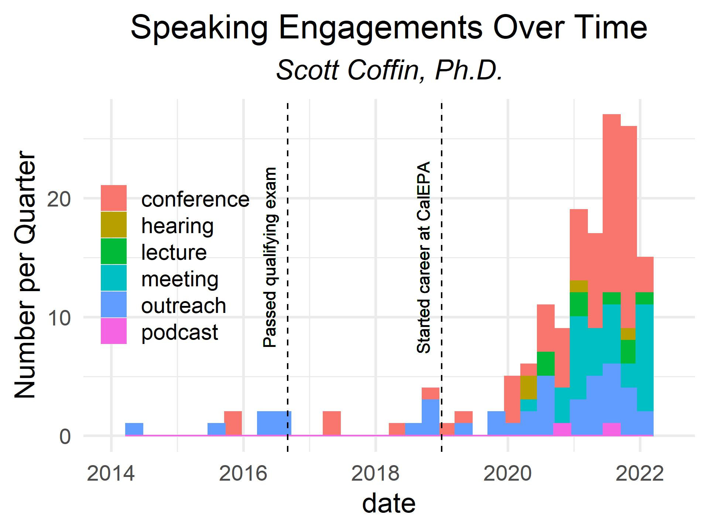

## Scott Coffin in the Media
The following is a **non-exhaustive** list of recent media highlighting my work. This includes recorded presentations from workshops as well as interviews and articles. If you'd like to find PDFs of my presentations, most can be found for free on [ResearchGate](https://www.researchgate.net/profile/Scott-Coffin-2/research).

### 2023

* [San Francisco Chronicle: "Scientists found microplastics in Sierra snowpacks. Should we worry about Bay Area drinking water?"](https://www.sfchronicle.com/california/article/sierra-snow-microplastics-drinking-water-17840942.php?utm_campaign=CMS%20Sharing%20Tools%20(Premium)&utm_source=t.co&utm_medium=referral)

* [Water Education Foundation: "Testing at the Source; California Readies a Groundbreaking Hunt to Check for Microplastics in Drinking Water"](https://www.watereducation.org/western-water/testing-source-california-readies-groundbreaking-hunt-check-microplastics-drinking)

* The Straits Times: "Hope in the time of microplastics" [web article (paywall)](https://www.straitstimes.com/world/united-states/hope-in-the-time-of-microplastics); [print article(full text)](/assets/publications/Straits2023.jpg)

* [Wired: Microplastics Are Polluting the Ocean at a Shocking Rate](https://www.wired.com/story/microplastics-are-polluting-the-ocean-at-a-shocking-rate/)

* [Talking PFAS Podcast: Episode 41 Scott Coffin California - Clean-Up Conference 2022 Adelaide](https://omny.fm/shows/talkingpfas/episode-41-scott-coffin-california-clean-up-confer?in_playlist=podcast)

### 2022

* [Finding Genius Podcast: First Government in the World to Mandate Regulations for Microplastics in Drinking Water: Ecotoxicologist Scott Coffin Explains](https://www.findinggeniuspodcast.com/podcasts/first-government-in-the-world-to-mandate-regulations-for-microplastics-in-drinking-water-ecotoxicologist-scott-coffin-explains/?preview=true)

<iframe src="https://castbox.fm/app/castbox/player/id2652354/id553789844?v=8.22.11&autoplay=0" frameborder="0" width="100%" height="500"></iframe>

* [EcoJustice Radio: "Microplastics Are Everywhere: What’s The Risk?"](https://soundcloud.com/socal350/microplastics-are-everywhere-whats-the-risk)

* [Dr. Scott Coffin's Interview with ABC radio: The World Today September 12, 2022)](https://soundcloud.com/scott-coffin/dr-scott-coffins-interview-with-abc-radio-the-world-today-september-12-2022?si=ae2f78304d0e45898a6ec1f2bf257cae&utm_source=clipboard&utm_medium=text&utm_campaign=social_sharing)

* [Spectrum News: Labs prepare for first-of-its-kind water directive](https://spectrumnews1.com/ca/la-west/health/2022/09/15/labs-prepare-for-first-of-its-kind-water-directive)

* [Nautilus: You Eat a Credit Card’s Worth of Plastic Every Week: What is our hidden consumption of microplastics doing to our health?](https://nautil.us/you-eat-a-credits-card-worth-of-plastic-every-week-238481/?_sp=7c9821b1-3b8d-42a8-a0f8-5a877c434cf8.1670361835654)

* [CalMatters: California approves microplastics testing of drinking water sources](https://calmatters.org/environment/2022/09/california-microplastics-testing-drinking-water-sources/)

* [San Francisco Chronicle: California becomes first state to test drinking water for microplastics](https://www.sfchronicle.com/bayarea/article/California-microplastic-test-17423549.php)

* [Scientific American: Replacing Lead Water Pipes with Plastic Could Raise New Safety Issues](https://www.scientificamerican.com/article/replacing-lead-water-pipes-with-plastic-could-raise-new-safety-issues/?utm_medium=email&utm_source=govdelivery)

* [Sierra Nevada Aquatic Research Lab Spring Seminar Series 2022: "Microplastics - a Macro Problem?"](https://www.youtube.com/watch?v=AzQX-ddkrGk)

<iframe width="280" height="158" src="https://www.youtube.com/watch?v=AzQX-ddkrGk" title="YouTube video player" frameborder="0" allow="accelerometer; autoplay; clipboard-write; encrypted-media; gyroscope; picture-in-picture" allowfullscreen></iframe>

* [National Geographic: Microplastics are in our bodies. How much do they harm us?](https://www.nationalgeographic.com/environment/article/microplastics-are-in-our-bodies-how-much-do-they-harm-us)

* [KCRA: Forecasting Our Future: Our world is full of microplastics. California is leading efforts to change that](https://www.kcra.com/article/our-world-is-full-of-microplastics-california-is-leading-efforts-to-change-that/39799569)

* [California Ocean Day 2022. Microplastics: Califorrnia's BIG little plastic problem with CSU COAST, Senator Ben Allen, Dr. Scott Coffin, and Dr. Eunah Hoh](https://www.calstate.edu/impact-of-the-csu/research/coast/about/Pages/Briefings-Panels.aspx)

<iframe width="280" height="158" src="https://www.youtube.com/embed/m-_mCRA2sO4?start=280" title="YouTube video player" frameborder="0" allow="accelerometer; autoplay; clipboard-write; encrypted-media; gyroscope; picture-in-picture" allowfullscreen></iframe>

* [Environmental Law Institute: "The Debate: Can We Make Plastic Sustainable?"](https://www.eli.org/sites/default/files/files-pdf/tef-march-april-2022-debate.pdf)

* [Environmental Health News: Scientists: US needs to support a strong global agreement tocurb plastic pollution](https://www.ehn.org/us-plastics-2656802114.html)

* [KQED: 'You Can't Recycle Your Way Out': California's Plastic Problem and What We Can Do About It](https://www.kqed.org/news/11901288/you-cant-recycle-your-way-out-californias-plastic-problem-and-what-to-do-about-it)

### 2021

* [KQED Newsroom Special: California’s Plastic Problem](https://www.youtube.com/watch?v=-bTCCB6wbks&feature=emb_imp_woyt)
<iframe width="280" height="158" src="https://www.youtube.com/embed/-bTCCB6wbks" title="YouTube video player" frameborder="0" allow="accelerometer; autoplay; clipboard-write; encrypted-media; gyroscope; picture-in-picture" allowfullscreen></iframe>

* [WaterWorld.com: World’s first standardized testing for microplastics in drinking water](https://www.waterworld.com/drinking-water/potable-water-quality/press-release/14215238/worlds-first-standardized-testing-for-microplastics-in-drinking-water)

* [Spectrum News 1: As need to test water for microplastics increases, California finds a way](https://spectrumnews1.com/ca/la-east/environment/2021/10/26/our-water-will-need-to-be-tested-for-microplastics--california-finds-a-way#)

* [Key Ingredients to Effective Science Communication: Focus on Microplastics Science and Policy](https://www.youtube.com/watch?v=tPtPzL4PQvk)

<iframe width="280" height="158" src="https://www.youtube.com/embed/tPtPzL4PQvk" title="YouTube video player" frameborder="0" allow="accelerometer; autoplay; clipboard-write; encrypted-media; gyroscope; picture-in-picture" allowfullscreen></iframe>

* [North Carolina Coastal Microplastics Forum](https://www.youtube.com/watch?v=75OEJnqfaEw)

* [Report of RNRF Round Table: Meeting the Challenge of Microplastic Management to Protect Human Health and the Environment](https://rnrf.org/news/)

* [Los Angeles Times Opinion: Microplastics are getting into our bodies. We need to understand what that means](https://www.latimes.com/opinion/story/2021-07-13/opinion-microplastics-are-getting-into-our-bodies-we-need-to-understand-what-that-means)

* [National Academies of Sciences, Engineering, and Medicine Food Forum: Microplastics from Food and Water: State of the Science and Potential Impacts on Human Health](https://www.youtube.com/watch?v=S56nsUvTR2I&list=PLGTMA6Qkejfj4AzYBMq1cFtlkLvXbFexi&index=4)

<iframe width="560" height="315" src="https://www.youtube.com/embed/S56nsUvTR2I" title="YouTube video player" frameborder="0" allow="accelerometer; autoplay; clipboard-write; encrypted-media; gyroscope; picture-in-picture" allowfullscreen></iframe>

* [CalMatters: Premature or precautionary? California is first to tackle microplastics in drinking water](https://calmatters.org/environment/2021/03/california-microplastics-drinking-water/)

* [Medium.com: What you Don’t Know Can Hurt You: Taking the Precautionary Approach to Microplastics and Nanoplastics](https://medium.com/living-in-the-plastocene/what-you-dont-know-can-hurt-you-taking-the-precautionary-approach-to-microplastics-and-cf8242d25dab)

* [Small Particles, Big Problems? Scientists Grapple with Many Unknowns about Microplastics and Their Impact on the Chesapeake Bay](https://www.chesapeakequarterly.net/V19N2/main1/)

* [The Jefferson Exchange: California Moves To Monitor Microplastics In Drinking Water](https://www.ijpr.org/show/the-jefferson-exchange/2021-01-20/thu-8-30-california-moves-to-monitor-microplastics-in-drinking-water)

* [The Zero Waste Countdown Podcast: Endocrin Disruptors and Plastics](https://zerowastecountdown.podbean.com/e/114-estrogen-epigenetics-and-plastic/)

* [SCCWRP 2021 Winter Newsletter Spotlight](https://ftp.sccwrp.org/pub/download/DOCUMENTS/DirectorsReports/2102DirRep.pdf)

### 2020

* [LAMPOON Magazing: Every time you open a water bottle, you release thousand of microplastics](https://www.lampoonmagazine.com/article/2022/03/12/microplastics-scott-coffin/)

* [SCCWRP Microplastics Health Effects Meeting Day One](https://vimeo.com/469902307)

* [Leading Britian's Conversation Radio Interview](https://soundcloud.com/scott-coffin/lbc-radio-interview-w-tom)

* [Inland Ocean Coalition (Wyoming Chapter)- Microplastics Hit Home: Human Exposure, Health Effects and Inland Impacts](https://www.youtube.com/watch?v=oxM1GOf3zmI)

<iframe width="280" height="158" src="https://www.youtube.com/embed/oxM1GOf3zmI" title="YouTube video player" frameborder="0" allow="accelerometer; autoplay; clipboard-write; encrypted-media; gyroscope; picture-in-picture" allowfullscreen></iframe>

* [Washington Core: Burgeoning microplastics pollution prompts regulatory action to protect drinking water in California](https://www.wcore.com/burgeoning-microplastics-pollution-prompts-regulatory-action-to-protect-drinking-water-in-california/)

* [Wyoming Tribune Eagle: Cheyenne Native Helping Lead Study of Microplastics in Drinking Water](https://media-exp1.licdn.com/dms/document/C562DAQFgdUKJWEqHfQ/profile-treasury-document-pdf-analyzed/0/1598464836947?e=1622073600&v=beta&t=Vyh9L9YT0Jhm2fm47Yj1ataR85J9wa_2n5WQ31NbOTs)

* [State Water Board adoption Meeting of Microplastics in Drinking Water Definition](https://www.youtube.com/watch?v=WeSwUinbnks)

* [Beyond Plastics- Tiny Pieces, Big Problem: Microplastics in Our, Water & Bodies](https://www.youtube.com/watch?v=-KzT--lJDns)
<iframe width="560" height="315" src="https://www.youtube.com/embed/-KzT--lJDns?start=1754" title="YouTube video player" frameborder="0" allow="accelerometer; autoplay; clipboard-write; encrypted-media; gyroscope; picture-in-picture" allowfullscreen></iframe>

* [A story about Microplastics (Trash Datathon 2020)](https://www.youtube.com/watch?v=7oxy8KrAv2A)

* [Plasticast Episode3 - Dr. Scott Coffin](https://www.youtube.com/watch?v=MTbqrfewuKY)

<iframe width="560" height="315" src="https://www.youtube.com/embed/MTbqrfewuKY" title="YouTube video player" frameborder="0" allow="accelerometer; autoplay; clipboard-write; encrypted-media; gyroscope; picture-in-picture" allowfullscreen></iframe>

### 2019

* [Getting to Know H2O - the Water Cycle](https://www.youtube.com/watch?v=Eu6Jhit4TAA)

<iframe width="280" height="158" src="https://www.youtube.com/embed/Eu6Jhit4TAA" title="YouTube video player" frameborder="0" allow="accelerometer; autoplay; clipboard-write; encrypted-media; gyroscope; picture-in-picture" allowfullscreen></iframe>

*BONUS* This film is designed for students from elementary school to college, and comes with a [study guide](https://gluckprogram.ucr.edu/glucktv-steam-channel) designed by Gluck Fellows Program of the Arts at UC Riverside. Please share with educators. 
This film won the People' Choice Award at the 2019 American Chemical Society Environmental Film Competition in San Diego, California.

* [Toxicology Panel - Microplastics Conference at Rutgers University 2019](https://www.youtube.com/watch?v=WEyNJs5ViMM&list=PLXBdkowE6UzYQ2Ojv0WlOSJ0pNjBhXewT&index=6)

### Graph

The following stacked barplot is a summary of the talks I have given since I started counting in 2014. Total = 175 as of May 25, 2022.

<!--{:height=700px" width="700px"}-->

<iframe src="/assets/widgets/engagements.html" height="600px" width="100%" style="border:none;"></iframe>

### Data Table

Above is not a comprehensive list, but below is:

<iframe src="/assets/widgets/datatable.html" height="600px" width="100%" style="border:none;"></iframe>
